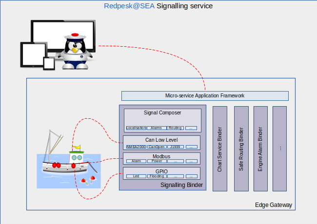
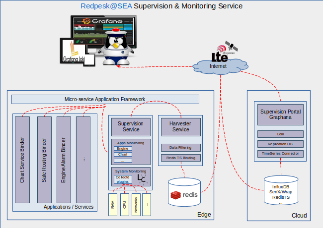

# Introduction:

This project targets a production ready marine grade Linux open platform . Its application and security model derives directly from Automotive Grade Linux[^1] efforts, when production readiness and long term support relies on IoT.bzh continuous integration redpesk[^2] suite.

## Goal

Provide a modern open platform dedicated to next generation of marine embedded applications. The project is a clean break forward from existing Linux maritime projects and aims at providing a clean and modern foundation that will foster development of next generations of maritime services targeting not only leisure sailors but also professional boats with services focus on: navigation/routing, security, energy saving, predictive maintenance and last by bnot least on a longer term: partial to full autonomous boat.

### Primary goals includes:
* Out of the box support of core marine services as:
  * Signalling: CAN, N2K, J1939, CanOpen, Modbus, ...
  * Cloud Connectivity: 3/4G, Wifi, Bluetooth, ...
  * Chart: S57,S101,Taster, ....
  * Routing: autopilot, motorcontrol, ...
  * ...
* Hardware reference boards
  * Community: Raspberry, Mino, ...
  * Professional: IMX6, STM32MP1, IMX8, RCAR, 
  * ...
* Open Software architecture
  * Builtin Cybersecurity model
  * API centric and Microservice based architecture
  * Allow final solution to mix OpenSource and proprietary softwares
  * Long term support targeting 10 years or more
  * ...
 

### Out of Scope:

Porting existing/legacy softwares or pre-integrating hardware may obviously have values for the community and should obviously remains possible. Nevertheless this is not the focus of this project. 

Are excluded from goals:
 * Improving/rewriting new version of existing well known maritime softwares (OpenCpn, QtVlm, zyGrib, SignalK, ...)
 * Creating a new pre-integrated marine distributions (OpenPlotter, Marinux, SkipperOS,  ). 
* Pre-configure a specific distro with a specific set of hardwares (Bareboat, BoatPC, ...)

# Architecture

## API based Micro Service Architecture

The application architecture is directly inherited from AGL[^1] and is based on latest version of the application framework[^4]. 

Within Automotive Grade Linux, each micro service exposes an API that can be requested independently of used message transport layer (REST, UnixSocket, RAM, ...) and from its location (edge, cloud). Application and cybersecurity protection is done thought a mixt of kernel mandatory access (SMack, SELinux) and Access control data base as Cynara.

Microservice based architecture are very flexible. They typically allow to split or group service within the same or different devices depending on production requirements. From a developer point of view the fact a service run into an external 'gateway' or within the same SOC is 100% transparent. Obviously service location still impact performances or security model, but the flexibility provided by the architecture allow to run the same code on different implementation (i.e. low cost versus full feature system)

Previous graphic represents a full feature system. An entry cost system could use the same services with only one gateway and without any display. On the other high end systems may require multiple screens (chart-table, cabin, cockpit, ...). Note that the architecture also represents a Linux microcontroller dedicated to critical services. Those critical/safety services may either run in a fully external devices based on a STM32 or equivalent device, or directly within the M5-7 microcontroller integrated within an Imx8 or Rcar SOC.

## Cyber-Security

Redpesk@SEA relies on the latest version of Automotive Linux security models.

At installation time not only each packet signature is verified, but each checksum file contain is also control. Services are installed and run with minimal required privileges. As redpesk is a package based distribution, it is possible to update atomically services.

At run time microservices are protected with a Linux MAC (Mandatory Access Control) either Smack or SeLinux. Then, access to the service is granted by Linux kernel, the application framework applies a fine grade control using Cynara database.

When talking with the cloud or an external device (I.e. phone, tablet) the application framework switches from kernel security to Internet security and use oAuth2 and OpenIDconnect to request authentication/authorization tokens that later replace MAC token as input to the Cynara access control data base.

For further detail on security model check AGL security blueprint [^5]

## Core Services

While Redpesk@SEA is fully open an may potentially support any kind of services. Most user expect some core services to be provided "out-of-the-box". This list of core services may expend in the future, but as today we expect to ship with default opensource version following components:

### Signaling

Automotive Linux support in its current version CAN and J1939. For Redpesk@SEA IoT.bzh already added support for CanOpen, Modbus as well as as a reverse engineered version of NMEA2000[^6] based on Canboat[^7] and others works.

Signaling split into low level binding that are in charge of decoding a binary message (N2K, CanOpen, Modbus, ...) into a high level structure that is easy to process by an application. Second level is handle by the signal composer that is in charge of composing message to build a functional signal as the boat moved more than 300m. The goal is this model is to reduce as close as possible from the acquisition the number of processed messages. 

For further detail on signaling model check[^8]

### Chart

Redpesk@SEA aims at providing core low level chart service. A full UI as OpenCPN or QtVLM remains out of scope. Nevertheless we aim at providing a strong chart core set of char services to help that the community to easily develop multiple user interfaces targeting the difference class of maritime users (leisure, fisherman, researcher, ship-yard, harbour, ...).

In a first run, chart service should be able to provide a vector tile service compatible with Mapbox. Chart service should support both a realtime service to serve tiles on demand to UI clients through a standard set of APIs, as well as an out of band service to translate with GDAL or equivalent technology charts from their delivery format(S57,S101,...) into a set of vector tiles compatible Mapbox vector tiles format[^9]

### Cloud Connectivity

Exchanging data with Internet for both incoming and outgoing streams in a secure manner is critical to support many modern use cases. This secure connection is required to support both external devices (phone, tablet) connecting directly on a boat gateway, or 4G/Satellite connectivity with a cloud service.

As by definition boat can get far enough from ground antenna to loose connectivity, it is key to support connection break down as well as stream selection to limit satellite communication cost. 

As cloud connectivity the initial implementation propose a mechanism not only to secure stream from/to the cloud, but also a standard option to stage data on the edge waiting for adequate connectivity to be available.

### Native Graphic

While not everyone require native graphic support, anyone who need to support an embedded screen to display UI will need some form of graphical support.

For remote UI HTML5 is tha magic wand, unfortunately for native screen support Wayland only provide very low level API and needs to be complemented in order to support application developers. In order to support Linux existing UI the system should support XDG as well as some hight level compositor foundation as WLRoot, Fluter or others. While no compositor will ever support every use cases, reference implementation should support one that enable people to get native UI working almost our of the box.

### Monitoring

Monitoring a key requirement for any long term supported system. Monitoring should be able to support multiple use cases as:

* Enabling developers to trace requests in realtime when debugging
* Collecting long term data track when doing final in situation QA test
* On line data collection to track security break, functional errors, usage patterns, ...

Redpesk@SEA inherit from Automotive Linux application framework monitoring capabilities, it can introspect service API, hook incoming/outgoing messages and support a standard monitoring of Linux general behavior (CPU, RAM, Network, ...). All collected data can either be display in realtime (debug case) or store in a timeserie database for further use with standard tools as Graphana or others.

### Multimedia

[^1]: http://automotivelinux.org
[^2]: http://redpesk.bzh
[^4]: https://iot.bzh/en/publications/40-2020/107-agl-amm-july20-appfw-perfs
[^5]: http://iot.bzh/download/public/2018/Security/AGL-Security-blueprint_v5.0.0.pdf
[^6]: https://www.nmea.org/Assets/20090423%20rtcm%20white%20paper%20nmea%202000.pdf
[^7]: https://github.com/canboat/canboat
[^8]: https://iot.bzh/en/publications/32-2018/92-updated-overview-of-agl-signaling
[^9]: https://docs.mapbox.com/vector-tiles/specification/

